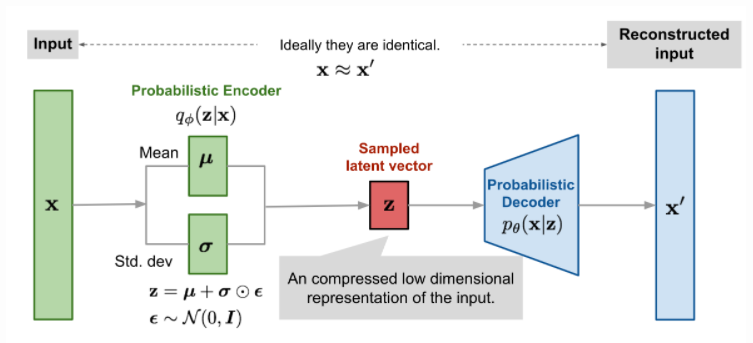
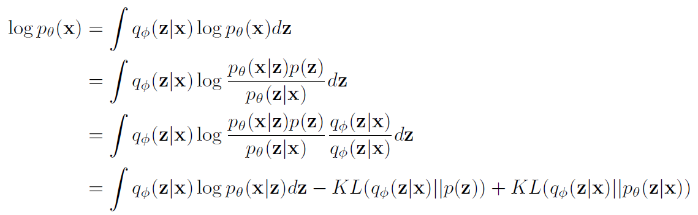
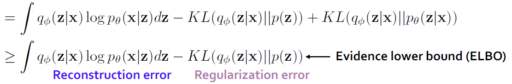
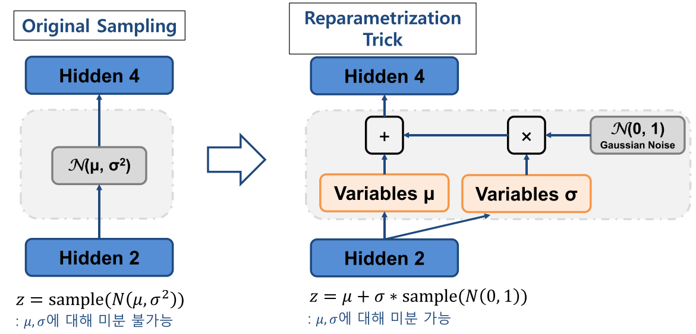
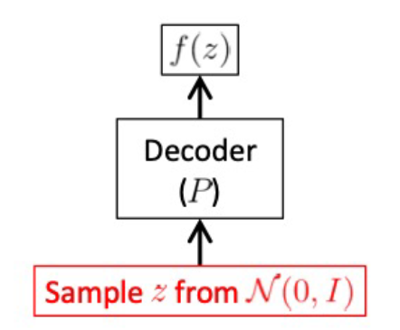
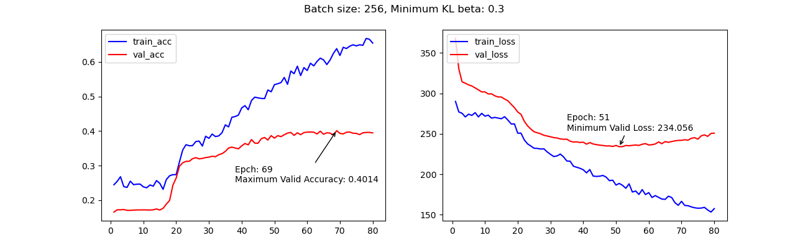

# MusicVAE
## 프로젝트 구조
```bash
    musicvae
    ┣ config
    ┃ ┗ base_config.yaml
    ┣ data
    ┃ ┗ groove
    ┣ images
    ┣ saved_model
    ┃ ┗ generated.midi
    ┣ src
    ┃ ┣ dataloader.py
    ┃ ┣ loss.py
    ┃ ┣ model.py
    ┃ ┣ preprocessing.py
    ┃ ┣ trainer.py
    ┃ ┗ utils.py
    ┣ README.md
    ┣ main.py
    ┗ requirements.txt
```
## 실행 방법
train

    python main.py -mt


generate

    python main.py -mg

## 논문 요약
- 기존의 RNN 구조는 직전 데이터의 영향을 많이 받고 오래 전 데이터의 영향은 갈수록 줄어드는 문제점이 있음.
- 계층적인(Hierarchical) 구조를 도입해 가까운 정보 뿐만 아니라 데이터 전체적인 정보(분포)를 반영할 수 있도록 함.
- 이를 위해서 Variational Autoencoder(VAE) 구조를 활용하고 Encoder, Decoder 이외에 Conductor 구조를 추가.

### 과정
- Encoder -> Conductor 과정: prior p(z)와 posterior q(z|x)가 최대한 비슷해지도록 파라미터(λ) 학습.
- Conductor -> Decoder 과정: q(z|x)에서 생성된 값을 decoder에 입력하여 encoder 입력값인 x와 decoder에서 생성된 x'의 차이가 최소화 되도록 파라미터(θ) 학습.

### 모델 구조
- Encoder: Bi-LSTM(I.512, H.2048)
- Conductor: LSTM(I.512, H.1024)
- Decoder: LSTM(I.1024(512+512), H.1024)

- Optimizer: Adam

## 데이터 전처리
- "groove-v1.0.0-midionly.zip" 데이터를 사용.
1. 파일에 담겨있는 정보가 4/4박자인지 확인.
2. 파일의 Note 정보(드럼 소리)를 적절한 위치(시간)에 인덱싱.
3. 통일된 입력을 위해 일정한 길이(64)로 데이터를 나눔.
4. 9가지 드럼 소리를 원-핫 인코딩으로 변환(512).
5. 하나의 pickle 파일로 저장.

결과적으로 5020개 데이터 사용(train: 4518, eval:502)

## 학습
### Variational Autoencoder


VAE의 목적은 p(x)를 최대화하는 것을 목적으로 한다. 쉽게 이야기해서 입력 x가 주어졌을 때, z에서 샘플링된 입력값을 받은 decoder가 아웃풋으로 x를 낼 확률을 최대화 하는 것이다.



VAE에서 목적함수는 p(x)이다.



이를 풀어쓰면 ELBO 부분과 KL-divergence 부분으로 나누어지는데, KL-divergence는 항상 0보다 같거나 크기 때문에 logp(x) >= ELBO가 성립한다.

즉, ELBO를 최대화하는 것이 p(x)를 증가시키는 것이다.
ELBO는 두 개의 항으로 나누어지는데, 첫번째 항은 encoder에 x가 입력됐을 때 decoder에서 x가 재구성되는 것을 의미한다. 이를 reconstruction term이라고 한다.

두번째 항은 encoder를 통해 얻은 q(z|x)와 conductor의 p(z)가 비슷한 정도를 의미한다.

만약 첫번째 항만 존재한다면 encoder의 입력값과 decoder의 출력값이 비슷하게 나오더라도 q(z|x)와 p(z)는 유사하지 않을 수도 있다. 하지만 두번째 항이 존재하기 때문에 비슷한 확률분포에서 샘플링된 값을 기반으로 encoder의 입력값과 decoder의 출력값이 비슷해지도록 모델이 학습된다. 이러한 이유로 regularization term이라고 부른다.

------------

### Loss function
학습에 사용하는 loss 값은 위에서 언급한 reconstruction과 regularization의 부호를 바꾼 ELBO loss값을 사용한다. 이 값을 줄이는 것이 모델의 성능을 높이는 것을 의미하기 때문이다.

Reconstruction error를 줄이는 과정에서 encoder와 decoder 파라미터가 최적화되고, regularization error를 줄이는 과정에서 encoder의 파라미터가 최적화된다.

1. Encoder가 입력 데이터를 처리하고 z의 평균, 표준편차에 대한 추정값을 출력.
2. Reparameterization trick을 통해 z의 샘플 생성.
3. 생성된 샘플 z를 decoder에 입력하고, decoder는 z를 미디 데이터로 변환.
4. ELBO loss를 계산. 입력 데이터와 출력 데이터의 Binary cross-entropy(reconstruction error)와 encoder가 출력한 z 분포와 prior p(z) 분포 사이의 KL-divergence를 계산.
5. ELBO loss를 사용하여 encoder, decoder, conductor의 gradient를 계산.
6. Optimizer를 사용하여 ELBO loss가 최소화 되도록 파라미터 업데이트.



z를 미분하기 위해서 표준정규분포 error(epsilon)항을 도입한다.

z = mu + sigma * eps 로 표현하면 z는 x의 샘플링 여부와 관계없이 표준정규분포에 관한 식으로 취급할 수 있고, 이를 통해 미분이 가능해진다. 이러한 방법을 reparametrization trick이라고 한다.

-------------------------------

- Encoder

주어진 x를 통해 최적의 잠재분포 z를 구한다. 이때 잠재분포는 정규분포를 가정하므로 정규분포의 모수인 평균(mu)과 표준편차(sigma)를 계산하는 것으로 잠재분포를 구할 수 있다.

- Conductor

각 마디의 첫 입력값을 z에서 샘플링을 하여 decoder에 전달해준다. 이로써 생성되는 음원이 길어지더라도 z에서 샘플링된 입력값과 크게 달라지지 않는다.

- Decoder

Conductor를 통해 z가 주어졌을 때 아웃풋이 x와 최대한 비슷하게 나올 수 있도록 파라미터를 최적화한다.

## 생성


1. Conductor에서 구한 z를 decoder의 입력으로 전달.
2. Decoder에서 생성된 prob를 output으로 저장.
3. output에 prob를 반영하여 표시된 512가지 경우 중에 하나를 라벨링.
4. 완성된 drum_roll을 이진법 표기로 바꾼 후 미디파일로 변환.

-------------------------------

## 결과

**설정**

- Batch size: 256(train data: 4608(18 batch), valid data: 256).
- Train data set shuffle, last batch drop.
- ELBO loss에서 Minimum KL-divergence beta: **0.3** 설정.



- 60 ~ 70 epoch에서 validation score 가장 높음.
- Train acc/loss는 학습이 진행될수록 향상.
- Valid acc/loss는 약 70epoch 이후 감소.
- 적은 학습 데이터 수로 인해 낮은 epoch에서도 과최적화 발생.
